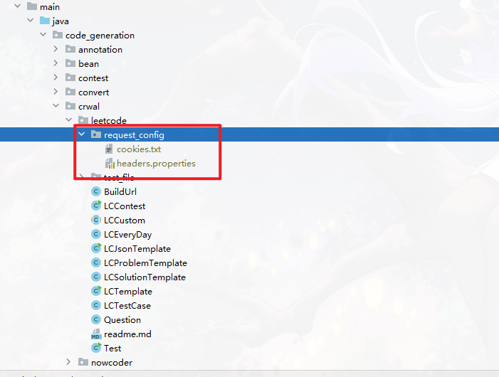
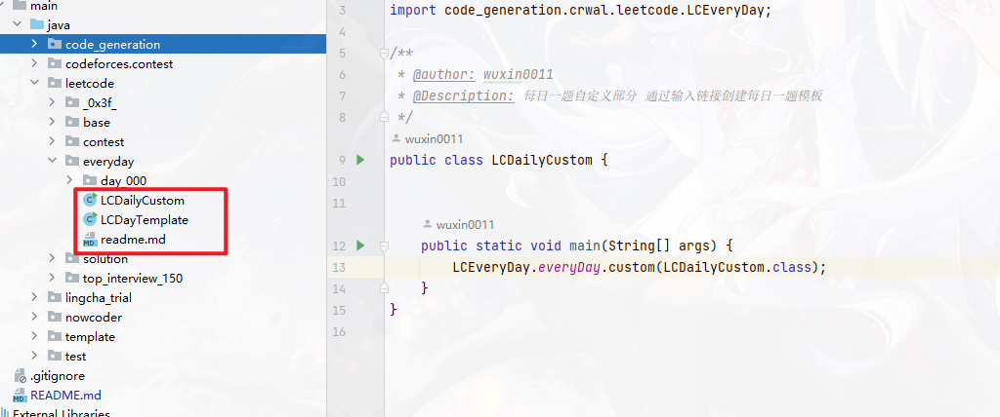
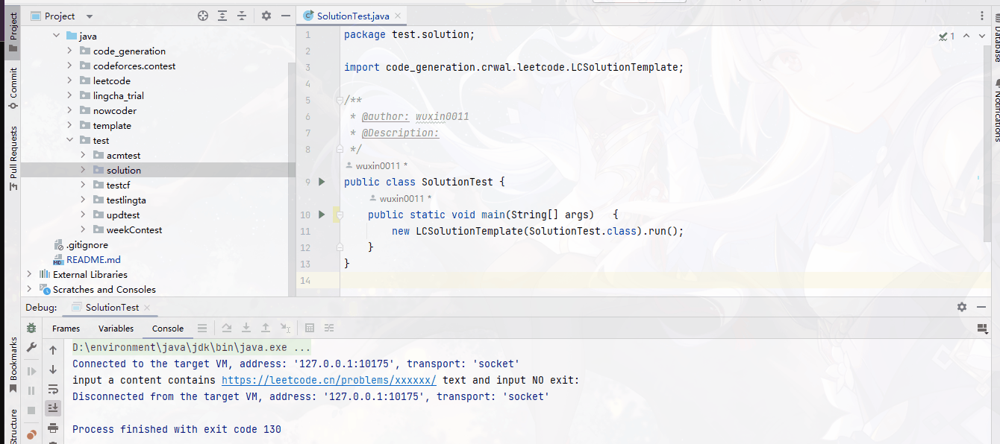
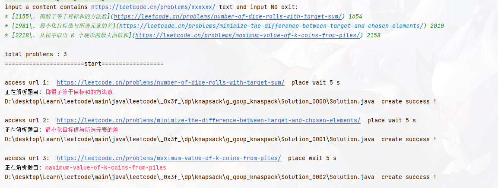
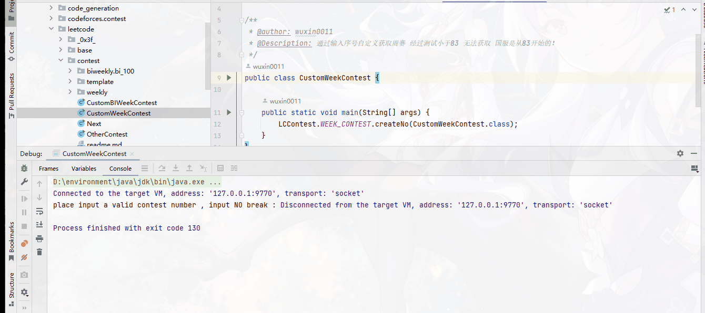
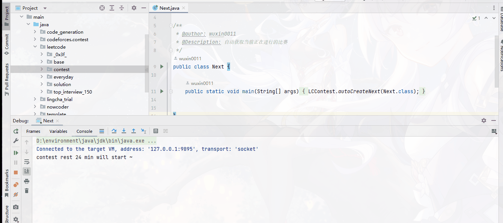

# 练习题笔记

## 👓 演示部分

  
查看配置

  

  
查看自动获取每日一题

  

  
查看通过题目链接自动获取题目

  
  

  
查看自定义周赛演示

  

  
点我查看获取当前比赛演示

  
  由于当前没有任何比赛因此没有抓取

## 📦 LeetCode验证失败 ？

[了解配置详情](./main/java/code_generation/crwal/readme.md)

## 🚀 推荐链接

### 网站

- [灵茶山艾府](https://leetcode.cn/u/endlesscheng/)
  - 点击讨论发布查看题单
  - 关于[bilibili](https://space.bilibili.com/206214)
- 大数据[zerotrac](https://zerotrac.github.io/leetcode_problem_rating/#/)
- [周赛分数预测](https://lccn.lbao.site/)
- 分数分类[rating](https://huxulm.github.io/lc-rating/)

### 插件
- [lc-to-markdown-txt-html](https://greasyfork.org/scripts/491969/feedback) 可将题目描述复制为 md 或 txt 格式
- [0x3f-problem-solution](https://greasyfork.org/zh-CN/scripts/501134-0x3f-problem-solution)灵茶题单插件

由于网络问题经常访问不了，可以尝试保存在本地 [点我测试🚀](https://huxulm.github.io/lc-rating/)

打开浏览器控制将下面内容复制到控制台run

  
查看代码

  <pre >
      <code class="language-javascript">
          const trs = document.querySelectorAll('table tbody tr')
          let ans = []
          Array.from(trs).forEach(tr=>{
          const tds = tr.querySelectorAll('td')
          const title = tds[2].querySelector('a').textContent
          const url = tds[2].querySelector('a').href
          const score = tds[3].querySelector('div').textContent
          // console.log(title,url,score)
            let obj = {
                title,
                score,
                url
              }
          ans.push(obj)
          })
          // console.log(ans)
          console.table(ans)
      </code>
  
  </pre>

将内容复制到本地保存为 xxx.json 文件

## 📚 完整题单推荐

- [题单](https://doocs.gitee.io/leetcode/tags.html)

## 📘 更新日志

- 2024/6/10 添加`@TestCaseGroup` 注解 用于根据需要测试哪一组数据 [See](./main/java/code_generation/annotation/TestCaseGroup.java)
- 2024/3/27 基本完成自动案例功能
- 2024/3/19 破坏性调整目录结构，新增代码`template`自动生成
- 2024/2/15 调整目录结构，为`ACM`模式做预留。另外 好像大部分题目都没有写，有点懒了，算了🤣。
- 2023/6/18 不知道啥时候首次提交了

## 👜Java版本信息

- JDK1.8
- [官方链接](https://leetcode.cn/)
- [中文接口文档](https://www.matools.com/api/java8)

## 🍉 其他

上述是我个人使用，如果你需要下载使用 可以使用我独立分离的其他版本

### ☕ Java  
  -  精简版本 [leetcode-template-simple](https://github.com/wuxin0011/leetcode-template-simple)，可以根据自己需求修改源码，方便自定义
  -  maven 版本 [java-lc-run](https://github.com/wuxin0011/java-lc-run) 如果出了bug，方便更新

### 🦎 python 
-  [ py-lc-run ](https://github.com/wuxin0011/py-lc-run)

