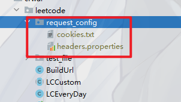

## 使用案例参考

- [自动抓取周赛案例](./../../../leetcode/contest/Next.java) [实现类](./LCContest.java)
- [自定义周赛或双周赛](./../../../leetcode/contest/CustomWeekContest.java) [实现类](./LCContest.java)
- [自定义其他竞赛](./../../../leetcode/contest/OtherContest.java) [实现类](./../../contest/Problem.java)
- [普通题目自定义模板](./../../../leetcode/solution/SolutionTest.java) [实现类](./LCSolutionTemplate.java)
- [每日一题](./../../../leetcode/everyday/LCDayTemplate.java) [实现类](./LCEveryDay.java)


## 问题相关

### 1、 模板配置 

爬取测试案例和模板需要配置本地`cookie` [查看配置](../request_config_template) 

**如果不配置 运行会自动生成😅 不过应该会报错 提示你需要配置相关信息！**

目前测试了两个平台

目录 ``request_config_template`` 到对应平台目录下





- **Leetcode**，请直接将  复制一份到 [leetcode](../leetcode) 目录下 并重命名为 `request_config`

-  **牛客**,执行上面同样操作 复制一份到 [nowcoder](../nowcoder) 目录下 并重命名为 `request_config` ，替换 `headers.properties` 默认配置 
```properties
Host=nowcoder.com
Referer=https://www.nowcoder.com/
Origin=https://www.nowcoder.com
Connection=keep-alive
Cookie=Cookie
Accept=*/*
Sec-Fetch-Mode=cors
Sec-Ch-Ua-Platform=Windows
User-Agent="Mozilla/5.0 (Windows NT 10.0; Win64; x64) AppleWebKit/537.36 (KHTML, like Gecko) Chrome/116.0.0.0 Safari/537.36 Edg/116.0.1938.62";
Accept-Language=zh-CN,zh;q=0.9,en;q=0.8,en-GB;q=0.7,en-US;q=0.6
Cache-Control=max-age=0
```
**别忘记配置Cookie了哦😵**


### 2、测试案例抓取失败

大概率是 cookie 失效了 请尝试重新复制到本地


### 3、为什么没有采用 账号密码方式自动登录获取测试模板 ？ 

这个功能已经写了但是获取失败 具体请看 [testLoginInfo ](./Test.java) 这个方法  如果你有更好实现方式 请 PR

由于采用的是原生JDK，除了JDK 自带库，没有依赖任何第三方库，因此解析起来已经很麻烦（水平有限😅）


**未来不确定是否会加进去**

## 详细说明


> headers.properties

```properties
Host=leetcode.cn
Referer=https://leetcode.cn/
Origin=https://leetcode.cn
Cookie=Cookie
Sec-Fetch-Mode=cors
Sec-Ch-Ua-Platform=Windows
Connection=keep-alive
Accept=*/*
User-Agent="Mozilla/5.0 (Windows NT 10.0; Win64; x64) AppleWebKit/537.36 (KHTML, like Gecko) Chrome/116.0.0.0 Safari/537.36 Edg/116.0.1938.62";
Accept-Language=zh-CN,zh;q=0.9,en;q=0.8,en-GB;q=0.7,en-US;q=0.6
Cache-Control=max-age=0
```

其他都配置好了主要是修改 `Cookie`

不会操作 ？ [点我](https://leetcode.cn/)，F12 打开控制台，网络->找到 https://leetcode.cn/ 请求的链接 复制 请求头中的
cookie，如果过期了请登录后修改！cookie 全部复制也没关系！

### 📚 配置 请求头

如果认为 cookie 配置在 ``headers.properties`` 有点麻烦，可以删除Cookie ，手动创建 `cookies.txt`
或者构建时会自动创建 `cookies.txt` 文件

**默认操作目录 当前类中的 `request_config` 这个目录中**

> cookies.txt 的优先级最高 会直接覆盖 headers.properties 中的 Cookie 属性，在 cookies.txt 中不需要 Cookie=xxxx,直接是xxx
> 因此如果 cookie 过期了可以直接在 cookies.txt 中修改


> example ： cookies.txt

```txt
gr_user_id=8629fa68-9b44-4f19-a0
5f-dbc83d442db9; a2873925c34ecbd2_gr_last_sent_cs1=agitated-c
urranfnd; _bl_uid=t2lsas4I8dIma15v8z2qd8O9bh5j; _gid=GA1.2.469048233.1
707529917; _ga_PDVPZYN3CW=deleted; _ga_JSBF1EVZXY=GS1.1.1710167959.2.0.17101679
59.0.0.0; csrftoken=77MX6yVgwMPRyE9PvsnzRNfTLaSrTPvYMkHwymTUTKRyt5IIzQ0hmEMQQUT
DOq7Y; tfstk=fPw9rtqltwbMByX9aS13grE0MzIhEREZJPrWnq0MGyUL8zFMnNkiDK3Luj01_NuYku4H
ndD_orLYSy0_koSZcqabkqVGtTqabxkfr-BlEllEqBBLWji6diijVdZHteoUbxkf-jHskUEarHWFJqHf
vvimfmMX1fspRc0BCm9scesK0FYOlZLIvbcQdgruwVQ-iGwEXf3Xn2vxO8poN4_-yppKe
ch99lgphKwLOUxEHV1yxqki7foTuTJZCjFbIvw1RtM7ayexNYCcbYELt7cT9N9x-R0IMRGd
FenUOlVbQPKvhcygEj3r9i9qivwoN7a90grICmsr882-iYToymA1vMd2gfiESU3lpSx2A9nK
rMjHgIlLWD3lvMd2gfiEv4jUzIRq9PC..; Hm_lvt_f0faad39bcf8471e3ab3ef70125152c3=171
1001264,1711246099,1711264335,1711325620; Hm_lvt_fa218a3ff7179639febdb15e372f411c
=1711247187,1711253763,1711265658,1711337076; Hm_lpvt_f0faad39bcf8471e3ab3ef7012515
2c3=1711384622; Hm_lpvt_fa218a3ff7179639febdb15e372f411c=1711413877; _ga_PDVPZYN3CW=GS1
.1.1711413688.241.1.1711413878.29.0.0; _ga=GA1.2.2037691452.1675754961; LEETCODE_SESSION=
eyJ0eXAiOiJKV1QiLCJhbGciOiJIUzI1NiJ9.eyJfYXV0aF91c2VyX2lkIjoiNDc4MDY2NyIsIl9hdXRoX3VzZXJfYmFja2
VuZCI6ImF1dGhlbnRpY2F0aW9uLmF1dGhfYmFja2VuZHMuUGhvbmVBdXRoZW50aWNhdGlvbkJhY2tlbmQiLCJfYXV0aF91c2
VyX2hhc2giOiI5MDljYTgyYzFlODM4OWZmMzQ2OTAzMDYxNTdlNzU4OGFkZGVmN2VkMzM2YzZjNzgzZDhhM2VjZGUyOWQzNjc
4IiwiaWQiOjQ3ODA2NjcsImVtYWlsIjoiIiwidXNlcm5hbWUiOiJhZ2l0YXRlZC1jdXJyYW5mbmQiLCJ1c2VyX3NsdWciOiJh
Z2l0YXRlZC1jdXJyYW5mbmQiLCJhdmF0YXIiOiJodHRwczovL2Fzc2V0cy5sZWV0Y29kZS5jbi9hbGl5dW4tbGMtdXBsb2FkL3
VzZXJzL2FnaXRhdGVkLWN1cnJhbmZuZC9hdmF0YXJfMTcwOTk2MzY3NC5wbmciLCJwaG9uZV92ZXJpZmllZCI6dHJ1ZSwiX3Rpb
WVzdGFtcCI6MTcxMTI2NjcxNy44MDA1NzI5LCJleHBpcmVkX3RpbWVfIjoxNzEzODEyNDAwLCJ2ZXJzaW9uX2tleV8iOjEsImxhdG
VzdF90aW1lc3RhbXBfIjoxNzExNDEzODg1fQ.LpH1FF1nXCgR7jnrNR48Wy6wSqwOIKPJzJt2GQ9M5WM; a2873925c34ecbd2_gr
_cs1
```

这是本人的cookie ，不负责已经过期了哦！😂

**担心cookie格式？没必要！已经过滤了cookie中不必要的字符！**

### 担心cookie泄露 ？

[点我修改](./BuildUrl.java) 以LeetCode演示为主 当前系统会默认过滤 ``request_config`` 这个目录 所以会自动保护隐私信息！！！

自定义路径和当前路径演示

```java
    // 默认从当前类的目录下的 request_config 目录 中读取配置文件
private static final Request request=new Request(BuildUrl.class);

// 如果为了保护隐私 可以使用 这样 cookies 就不会提交了自定义指定目录
// 一定要使用绝对路径！
// private static final Request request = new Request("D:\\desktop\\config");
```

目录内容

``request_config``
- headers.properties 配置网站请求头信息包括cookie，如果担心cookie太长可以配置在 cookies.txt 这个文件中
- cookies.txt 优先级最高 如果该文件不为空，会以该文件的内容作为 Cookie 来访问


## 更新日志

- 24.4.14 支持构造类对拍
- 24.4.2  支持最新场次周赛
- 24.4.1  添加隐私保护
- 24.3.27 上面大部分功能已经实现了，就是不知道是不是兼容所有，后面再说吧！[春季赛没弄]

