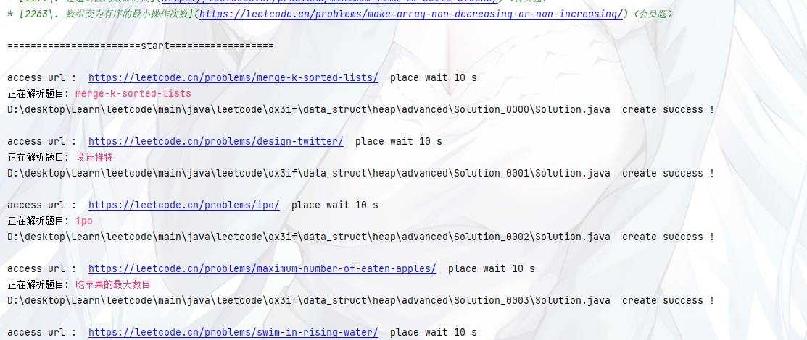

### 配置文件样例

系统请求会自动在 对应 目录下生成 ``request_config`` 这个目录

这个目录下会自动创建
- headers.properties
- cookies.txt

> 例如

[LeetCode](../leetcode/request_config)


### 批量测试

引用这个类 [LCSolutionTemplate](../leetcode/LCSolutionTemplate.java)

> 引入
```java
import code_generation.crwal.leetcode.LCSolutionTemplate;

/**
 * @author: wuxin0011
 * @Description:
 */
public class CodeTemplate {
    public static void main(String[] args) {
        new LCSolutionTemplate(CodeTemplate.class).run();
    }
}

```

> 演示

