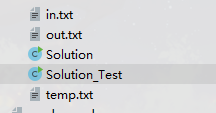

## ACM 模式输入输出 以及 测试 的简单封装


由于一些平台测试数据需要使用ACM模式


[具体示例参考](../../../nowcoder/exam/bidirectional_search/Solution01)


目录结构




### Solution_Test.java

[ACMUtil 类为调用系统生成的class文件](./ACMUtil.java) 

下面简单说明下了两个核心接口方法

- ACMUtil.run()          输出和输出 包括文件验证
- ACMUtil.runOnlyInput() 仅需要输出 


**示例**

```java
import code_generation.utils.ACM.ACMUtil;

public class Solution_Test {
    public static void main(String[] args) {
        ACMUtil.run(Solution.class);
    }
}

```

### solution.java 

[IO 类为封输出输出](./IO.java)

```java

public class Solution {

    public static void main(String[] args) throws IOException {
        IO io = new IO();
        // ...
        io.close();
    }
}

```

### in.txt

这个文件为输入文件 将输入格式


### out.txt

这个文件为预期结果


### temp.txt

这个文件生成的临时文件 重定向生成的，如果有必要的化生成的结果会同 out.txt 文件对比


## 问题

1. 为什么文件对比不是调用 系统 自带的 ``comb`` 命令 ？

   - 容易输出乱码
   - 不容易看出错误

2. 用 `git diff` 代替 文件对比  ?
   - 如果不是git托管的项目，使用这个命令，当然是没有问题，但是 经过测试 使用 git 托管
   的项目，如果使用给了这个命令对比文件不同，会默认同该文件历史记录对比。
   举个例子重定向生成的临时文件由于历史不存在 这个命令并不会比较两个文件不同，而是会同历史去对比
   因此简单写了个对比方法

3. 如果使用了ACM模式，并且使用了 [IO.java](./IO.java) 这个类，不要忘记同 放入 到``Solution`` 这个类中（类名根据平台默认而定），并用静态内部类方式 

```java
public class Solution {

    public static void main(String[] args) throws IOException {
        IO io = new IO();
        // ...
        io.close();
    }
    
    // 以这种形式拷贝过来在提交
    public static class IO {
        
    }

}
```