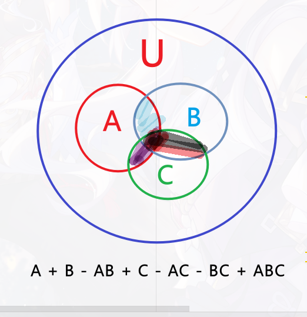

### §2.4 容斥原理

* [2652\. 倍数求和](https://leetcode.cn/problems/sum-multiples/)
* [878\. 第 N 个神奇数字](https://leetcode.cn/problems/nth-magical-number/) 1897
* [1201\. 丑数 III](https://leetcode.cn/problems/ugly-number-iii/) 2039
* [2929\. 给小朋友们分糖果 II](https://leetcode.cn/problems/distribute-candies-among-children-ii/)
* [2930\. 重新排列后包含指定子字符串的字符串数目](https://leetcode.cn/problems/number-of-strings-which-can-be-rearranged-to-contain-substring/)
* [2513\. 最小化两个数组中的最大值](https://leetcode.cn/problems/minimize-the-maximum-of-two-arrays/) 2302
* [3116\. 单面值组合的第 K 小金额](https://leetcode.cn/problems/kth-smallest-amount-with-single-denomination-combination/) 2387
* [3130\. 找出所有稳定的二进制数组 II](https://leetcode.cn/problems/find-all-possible-stable-binary-arrays-ii/) 2825
* [2927\. 给小朋友们分糖果 III](https://leetcode.cn/problems/distribute-candies-among-children-iii/)（会员题）

### 图示

