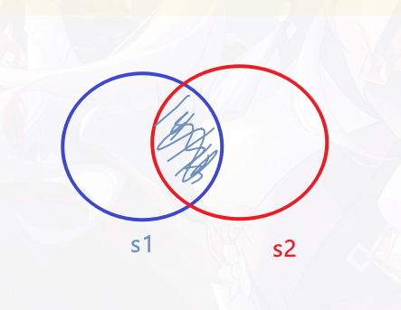

### 1、 [对角线最长的矩形的面积 ](https://leetcode.cn/contest/weekly-contest-379/problems/maximum-area-of-longest-diagonal-rectangle)

**模拟**

- 注意优先级问题 以及用 平方替代 平方根

### 2、 [捕获黑皇后需要的最少移动次数](https://leetcode.cn/contest/weekly-contest-379/problems/minimum-moves-to-capture-the-queen)

**贪心**  **脑筋急转弯**

- 一步
    - 分别考虑 ``象`` 和 `车` 能一步吃到黑皇后情况 ，简单俩说 如果车能一步吃到皇后，说明`象` 不在`车`和`皇后`中间
      对坐标判断就行

- 二步
    - 如果``象`` 在 `车` 和皇后中间 可以先移动 `象` 然后再移动`车` 而不是**三**步
    - 同理``车`` 在 `象` 和皇后 对角线上 而且在中间 可以先移动 `车` 然后再移动`象`
    - 不是一步吃到的其他情况 都是两步可以吃到的

### [3、移除后集合的最多元素数](https://leetcode.cn/contest/weekly-contest-379/problems/maximum-size-of-a-set-after-removals)

**数学** **集合**  **脑筋急转弯** **容斥原理**

加上 num1 为集合 `s1` num2 为集合 `s2`

如图要想保留更多元素 应当优先删除 两个集合的交集

然后判断删除的集合中元素是否 大于 1 半

### 4、[执行操作后的最大分割数量](https://leetcode.cn/contest/weekly-contest-379/problems/maximize-the-number-of-partitions-after-operations)

**记忆化搜索**
**前后缀分解**

【ps：3000分的题】 暂时搁置